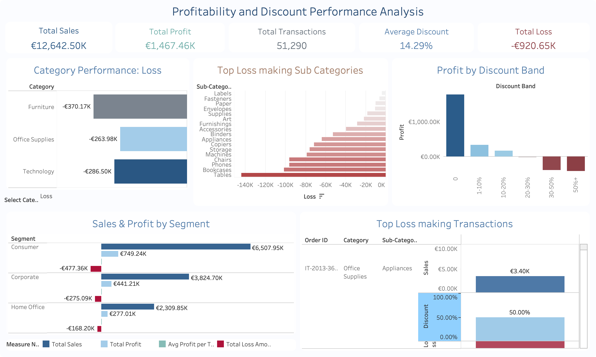
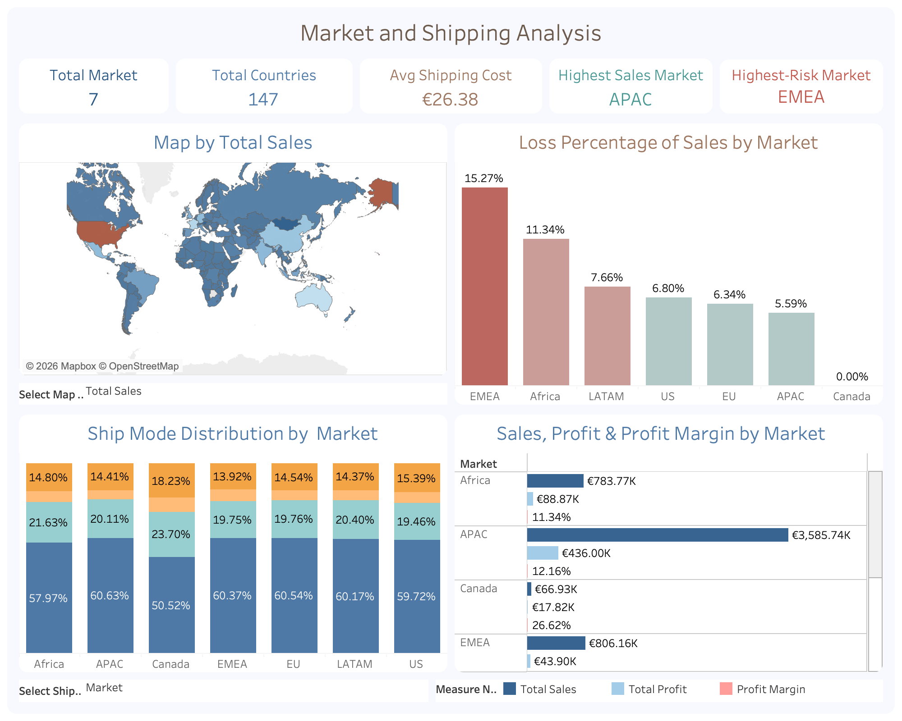

# Retail Sales and Profitability Analysis Project

## Project Overview

This project analyses the Global Superstore Orders dataset to understand retail performance across sales, profit, customer segments, markets, product categories, shipping modes, discounts, and loss-making transactions, helping to identify key performance drivers, areas of profit erosion, and insights that support dashboard development and business decision-making.

It combines exploratory data analysis, dashboard development, and data orchestration to create a more structured and repeatable analytics workflow.

The project includes:

- Exploratory data analysis using Jupyter Notebook
- Data preparation and feature engineering using Python and pandas
- Tableau dashboard development for business insights
- Dagster data orchestration for automated pipeline execution
- KPI validation using Dagster-generated summary metrics
---

## Business Problem

Retail organisations often generate sales across multiple regions, markets, product categories, and customer segments. However, high sales do not always mean high profitability and do not guarantee strong business performance if certain transactions, products, or markets are creating losses.

This project investigates the following business questions:

- Which customer segments generate the highest sales and profit?
- Which markets are the strongest and weakest in terms of profitability?
- Which product categories and sub-categories contribute most to profit loss?
- How does discounting affect profitability?
- Which shipping modes are most commonly used across markets?
- What are the common traits in transactions with highest losses?
- What areas should the business review to reduce profit erosion?

---

## Dataset

The project uses the **Global Superstore** dataset. The main dataset used for analysis is the **Orders** sheet from the raw Excel file.

The People and Returns sheets were briefly inspected for context, but the main analysis, dashboard, and pipeline outputs are based on the Orders dataset.

---

## Project Structure

```text
Retail_Profitability_Analysis_Project/
│
├── data/
│   ├── raw/
│   │   └── Global_Superstore.xls
│   │
│   ├── processed/
│   │   ├── orders_dashboard_dagster_ver.csv
│   │   └── orders_dashboard_notebook_ver.csv
│   └── outputs/
│       └── summary_metrics.csv
│
├── notebook/
│   └── retail_profitability_eda.ipynb
│
├── pipeline/
│   ├── __init__.py
│   ├── assets.py
│   └── definitions.py
│
├── dashboards/
│   ├── Market_and_Shipping_Analysis_Dashboard.png
│   └── Profitability_and_Discount_Dashboard.png
│
├── tableau_workbook/
│   └── Retail_Sales_Profitability_Dashboard.twbx
│
├── dagster_screenshots/
│   ├── Figure 1/ Dagster Asset Graph.png
│   ├── Figure 2/ Successful Dagster Materialization Run.png
│   ├── Figure 3/ Tableau-Ready Dataset Metadata.png
│   ├── Figure 4/ Summary Metrics Metadata.png
│   ├── Figure 5/ Generated Summary Metrics File.png
│   ├── Figure 6/ Summary Metrics CSV Output.png
│   └── Figure 7/ Notebook and Dagster Output Files.png
│
├── README.md
└── requirements.txt
```

---

## Tools and Technologies

| Tool             | Purpose                                             |
| ---------------- | --------------------------------------------------- |
| Python           | Data analysis and transformation                    |
| pandas           | Data cleaning, feature engineering, KPI calculation |
| Jupyter Notebook | Exploratory data analysis and calculation testing   |
| Tableau          | Dashboard development and visualisation             |
| Dagster          | Data orchestration and pipeline monitoring          |
| Excel/CSV        | Raw input and processed output files                |


---

## Project Workflow

The project follows this workflow:

1. **Raw Excel Dataset**  
   The original Superstore Excel dataset is used as the starting point.

2. **Jupyter Notebook Analysis**  
   The Jupyter Notebook is used to inspect the datasets, explore business patterns, create analysis fields, develop KPI logic, and prepare the Orders dataset for dashboard use.
   
3. **Tableau Dashboard Development**  
   Tableau is used to build two interactive dashboards: one focused on profitability and discount performance, and another focused on market and shipping analysis. The dashboards include KPI cards, parameter-based metric selection, category and segment performance views, discount impact analysis, loss-risk analysis, geographic mapping, and shipping mode distribution.

4. **Dagster Pipeline**  
   After completing the notebook analysis and Tableau dashboards, Dagster was added to make the workflow reproducible, automated, and easier to monitor. The pipeline loads the raw Orders dataset, applies validation checks, creates reusable analysis fields, and manages the workflow through asset dependencies.

5. **Tableau-Ready Dataset Export**  
   The Dagster pipeline exports the processed Orders dataset as a dashboard-ready CSV file. This allows the final dataset to be regenerated from the raw Excel file rather than relying only on manually prepared notebook outputs.

6. **KPI Validation with Dagster**  
   Dagster generates summary metrics for key dashboard KPIs, including total sales, net profit, total loss, average shipping cost, total markets, total countries, highest sales market, and highest loss-risk market. These metrics are used to cross-check the Tableau KPI cards and improve confidence in the dashboard outputs.
   
---
## Jupyter Notebook

Notebook file: `notebook/retail_profitability_eda.ipynb`

The notebook includes:

- Dataset loading and initial inspection
- Data quality checks, including data types, missing values, and duplicates
- Feature creation for analysis and dashboard use, including loss, positive profit, and discount band columns
- Segment, market, category, and sub-category profitability analysis
- Shipping mode analysis across markets and order priorities
- Discount impact analysis across overall sales and product categories
- Market profitability risk analysis using loss percentage of sales
- Transaction-level review of highest loss-making and profit-generating orders
- Summary findings with business recommendations
- Export of the modified Orders dataset for Tableau dashboard development

---

## Feature Engineering

Additional columns are created to support analysis and dashboard development:

```python
orders['Loss']=orders['Profit'].apply(lambda x: x if x<0 else 0)
orders['Positive Profit']=orders['Profit'].apply(lambda x: x if x>0 else 0)
orders['discount_band']=pd.cut(
    orders['Discount'], 
    bins=[-0.1, 0, 0.1, 0.2, 0.3, 0.5, 1], 
    labels=['0', '1-10%', '10-20%', '20-30%', '30-50%', '50%+']
)
```
These features make the dataset easier to use in dashboard tools.


## Tableau Dashboards

Two Tableau dashboards were developed using the processed Orders dataset prepared from the Global Superstore data by the notebook. The dashboards focus on profitability, discount impact, market performance, and shipping behaviour.

### Dashboard 1: Profitability and Discount Performance Analysis

This dashboard provides an overview of business profitability and identifies the main drivers of sales, profit, and loss. It focuses on customer segments, product categories, discount bands, and transaction-level loss patterns.


[](https://public.tableau.com/app/profile/iris.thitsar/viz/Book1_17784162436640/ProfitabilityDiscountDashboard?publish=yes)

**KPIs Included:**
- Total Sales
- Net Profit
- Total Transactions
- Average Discount
- Total Loss

**Charts Included:**
- Category Performance by selected metric: Total Sales, Net Profit, or Total Loss Amount
- Top Loss-Making Sub Categories
- Profit by Discount Band
- Sales and Profit by Segment, including Total Sales, Net Profit, Average Profit per Transaction, and Total Loss Amount
- Top 10 Loss-Making Transactions

### Dashboard 2: Market and Shipping Analysis

This dashboard analyses geographic performance, market-level risk, and shipping behaviour. It compares market profitability, identifies high-risk markets, and shows how shipping mode usage varies across markets and order priorities.

[](https://public.tableau.com/app/profile/iris.thitsar/viz/Book1_17784162436640/MarketandShippingAnalysisDashboard?publish=yes)

**KPIs Included:**
- Total Markets
- Total Countries
- Average Shipping Cost
- Highest Sales Market
- Highest Loss-Risk Market

**Charts Included:**
- Geographic Map by selected metric: Total Sales, Transaction Count, Net Profit, or Profit Loss
- Loss Percentage of Sales by Market
- Ship Mode Distribution by selected view: Market or Order Priority
- Sales, Profit, and Profit Margin by Market
---

## Summary of Findings

### Segment Performance

The Consumer segment is the main business driver, generating the highest sales, profit, and order volume. However, it also has the highest total loss, around 477K, showing that high transaction volume increases exposure to unprofitable orders. Corporate contributes around 59% of Consumer sales and profit while generating lower losses. Home Office has the lowest total sales and profit, but it has the highest average profit per transaction and the lowest total loss, around 168K.


### Market Performance

APAC is the strongest market, generating the highest sales and profit. EU and US also perform strongly, ranking second and third in both sales and profit. LATAM has the second-highest order volume but ranks only fourth in sales and profit, suggesting lower efficiency per order. EMEA and Africa show weaker profitability, while Canada has low sales volume but relatively stable profit performance.

### Shipping Mode Patterns

Standard Class is the most used shipping mode across most markets, accounting for around 58%-61% of orders. Second Class accounts for around 19%-22%, First Class around 14%-15%, and Same Day around 5%. This shows that customers generally prefer cost-efficient shipping over faster delivery. Shipping mode usage also varies by order priority, with critical orders relying more on faster shipping options.

### Category Profitability

Technology is the strongest category, generating the highest sales and profit while having the lowest number of loss-making transactions. Office Supplies has the highest transaction count and stable profitability, despite generating the lowest total sales. Furniture generates the second-highest sales but has the lowest profit and highest total loss, making it the main category linked to profit erosion.

### Discount Impact

Discounting has a clear impact on profitability. Non-discounted orders generate the strongest performance, with around €7.0M in sales and €1.77M in profit. Discounts between 0% and 20% generally remain profitable. Losses become more consistent from around 27%–30% onwards. Higher discount levels such as 40%, 50%, 60%, and 70% create substantial losses, showing that aggressive discounting reduces profitability.


### Discount Performance by Category

The 0%–10% discount band generates the highest profit across all categories, with Technology contributing around €835K, Office Supplies around €697K, and Furniture around €577K. The 10%–30% discount band remains profitable, but profit drops sharply. Once discounts exceed 30%, all categories move into negative profit. Furniture is the most affected category in the 30%–70% discount range.

### Sub-Category Loss Drivers

Losses are concentrated in a small number of sub-categories rather than spread evenly across all products. The largest loss contributors are Tables (-€144K), Bookcases (-€101K), Phones (-€96K), Chairs (-€96K), Machines (-€79K), and Storage (-€76K). Furniture-related sub-categories are major loss drivers, especially Tables, Bookcases, and Chairs.

### Market Profitability Risk

APAC and EU are the strongest markets in terms of profitability, with losses controlled at 5.59% and 6.34% of sales. The US and LATAM remain profitable but have slightly higher loss ratios of 6.80% and 7.66%. EMEA and Africa show higher profitability risk, with losses accounting for 15.27% and 11.34% of sales. This suggests weaker margin control in these markets.

### Transaction-Level Profitability

The top 10 loss-making transactions are all linked to high discounts of 50%–80%. This shows that extreme discounting can create severe losses even when sales values are high. On the other hand, the top 10 profit-generating transactions mostly have no discount, with only one using a moderate 20% discount. These profitable transactions are mainly from Technology and Office Supplies, while Furniture does not appear among the top profit-generating transactions.

---
## Recommendations

Based on the analysis, the main recommendations are:

1. **Strengthen discount controls**  
Discounts above 30% should be reviewed carefully because higher discount levels are strongly linked with profit erosion. Extreme discounts between 50% and 80% should be avoided unless there is a clear business reason, such as stock clearance or customer retention.

2. **Review Furniture category profitability**  
   Furniture generates high sales but also the highest total loss. Sub-categories such as Tables, Bookcases, and Chairs should be investigated for pricing issues, high costs, discounting problems, or shipping-related expenses.

3. **Protect strong-performing markets**  
   APAC, EU, and US should remain priority markets because they generate strong sales and profit. These markets should be monitored to maintain profitability and avoid unnecessary margin loss.

4. **Investigate weaker markets**  
   LATAM, EMEA, and Africa should be reviewed for possible pricing, logistics, discounting, or operational efficiency issues, as they show weaker profit efficiency or higher loss exposure.

5. **Balance segment strategy**  
   The Consumer segment should remain the main business focus due to its high sales and profit contribution. However, Corporate and Home Office should also be developed because they provide more stable profitability with lower loss exposure.

6. **Monitor transaction-level losses**  
   High-value transactions with heavy discounts should be reviewed regularly, as the largest losses are linked to aggressive discounting rather than low sales value.
   
---

## Dagster Data Orchestration

Dagster was added after the notebook analysis and Tableau dashboard development to make the workflow more reproducible, automated, and easier to validate.

The pipeline is defined using Dagster assets in:

`pipeline/assets.py`

The Dagster project is registered in:

`pipeline/definitions.py`

---

### Asset Flow

| Asset | Purpose |
|---|---|
| `raw_orders` | Loads the Orders sheet from the raw Global Superstore Excel file |
| `cleaned_orders` | Performs basic validation, numeric conversion, and missing-value handling |
| `engineered_orders` | Creates reusable calculated fields for analysis and dashboard preparation |
| `tableau_ready_orders` | Exports the processed dataset for Tableau |
| `summary_metrics` | Generates KPI values for dashboard validation |

---

### Data Cleaning and Validation

The pipeline performs basic validation to ensure the required numeric fields are suitable for analysis.

The required numeric columns are:

- `Sales`
- `Profit`
- `Discount`
- `Shipping Cost`

The pipeline checks that these columns exist, converts them to numeric format, and removes rows with missing or invalid values in these fields.

Although the Jupyter Notebook confirmed that the dataset was already mostly clean, these checks were included in the Dagster pipeline as defensive validation steps. This makes the workflow more reliable if the dataset is updated in the future.

---

### Feature Engineering

The pipeline creates additional fields consistent with the notebook analysis.

| Field | Description |
|---|---|
| `discount_band` | Groups discount values into bands such as 0, 1-10%, 10-20%, etc. |
| `Loss` | Keeps negative profit values and assigns 0 to profitable transactions |
| `Loss_Amount` | Converts negative profit values into positive loss amounts |
| `Positive_Profit` | Keeps positive profit values and assigns 0 to loss-making transactions |

These fields support clearer analysis of profitability, discount impact, and loss-making transactions.

---

### KPI Validation with Dagster

The `summary_metrics` asset was created to cross-check the KPI values shown in the Tableau dashboards. The metrics are calculated independently in the Dagster pipeline and compared with the Tableau KPI cards to improve confidence in the dashboard outputs.

The summary metrics output is saved to:

`data/outputs/summary_metrics.csv`

---

### Output Files

The pipeline generates two main output files.

| Output File | Purpose |
|---|---|
| `data/processed/orders_dashboard_dagster_ver.csv` | Processed dataset for Tableau dashboard development |
| `data/outputs/summary_metrics.csv` | KPI summary file used to validate Tableau dashboard values |

---

### Dagster Screenshots

Screenshots in `dagster_screenshots/` are included to show:

- Figure 1: Dagster asset graph
- Figure 2: Successful materialization run
- Figure 3: Tableau-ready dataset metadata
- Figure 4: Summary metrics metadata
- Figure 5: Generated summary metrics file
- Figure 6: Summary metrics CSV output
- Figure 7: Notebook and Dagster output files

These screenshots demonstrate that the workflow was successfully executed and that the dashboard outputs were validated against the Dagster pipeline.

---

## Project Value and Conclusion

This project demonstrates an end-to-end analytics workflow for retail sales and profitability analysis. It began with exploratory analysis in Jupyter Notebook, where the dataset was inspected, key calculations were tested, and profitability patterns were identified. Tableau was then used to develop dashboards that highlight sales performance, profit trends, loss-making areas, discount impact, shipping costs, and market-level performance.

Dagster was added at the final stage to make the workflow more repeatable, traceable, and easier to validate. The pipeline automates key data preparation steps, exports a dashboard-ready dataset, and generates summary KPI metrics that can be compared with Tableau dashboard values.

Overall, the project combines business analysis, dashboard development, and data orchestration in one workflow. It moves beyond one-time manual analysis by creating a more structured and reproducible analytics process where Jupyter Notebook supports exploration, Tableau delivers visual insights, and Dagster adds automation, monitoring, and validation.
